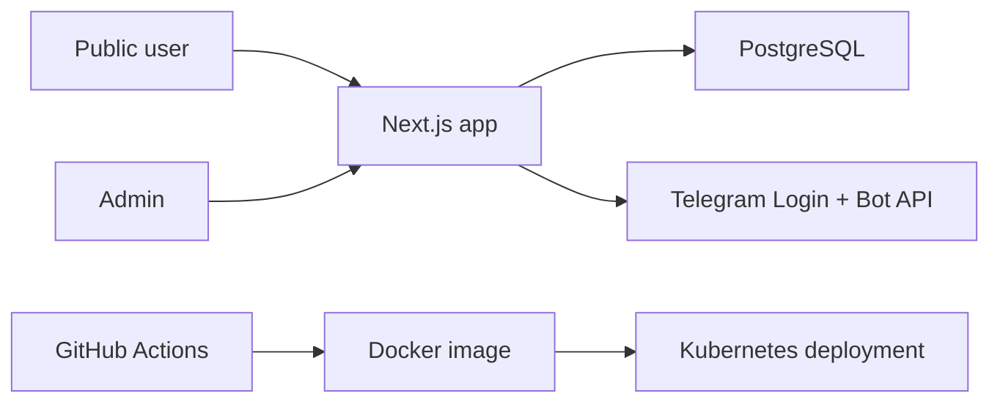

# Architecture Overview

## High-level design

The application is implemented as a single deployable Next.js monolith with server-rendered pages, server actions, and Prisma-backed domain services.

## Why this shape

- A monolith is the fastest way to deliver cohesive auth, UI, domain rules, and admin operations without premature distributed-system overhead.
- Prisma keeps the domain model explicit and strongly typed.
- Next.js server actions reduce API boilerplate for internal workflows while still supporting public pages.
- The runtime remains horizontally scalable because all durable state lives in PostgreSQL and sessions are server-side.

## Main domain areas

- Identity: `User`, `AuthSession`, `Ban`, `AdminUserRating`
- Event planning: `Event`, `EventLineupSlot`, `Track`, `TrackSeat`, `SetlistItem`, `SelectionRun`, `EventEditLock`
- Discovery and catalog: `Artist`, `Song`, `SongCatalogRequest`
- Collaboration: `TrackInvite`, `EnsembleGroup`, `EnsembleGroupMember`

## Security notes

- Sessions are opaque cookies backed by hashed server-side session tokens.
- Telegram auth payloads are verified by HMAC against the bot token.
- All privileged mutations require server-side role checks.
- Bans are enforced server-side before participation mutations.
- Production deployment expects secrets to come from Kubernetes `Secret` resources, not committed files.
